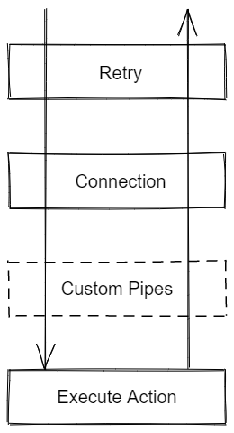

# Socolin.RabbitMQ.Client

[](https://www.nuget.org/packages/Socolin.RabbitMQ.Client)

A simple wrapper around [RabbitMQ.Client](https://github.com/rabbitmq/rabbitmq-dotnet-client) to make it easier to use.

## Example

```cs
const string queueName = "some-queue-name";
var options = new RabbitMqServiceOptionsBuilder()
	.WithRetry(TimeSpan.FromSeconds(15), null, TimeSpan.FromSeconds(1))
	.WithConnectionManager(_rabbitMqConnectionManager)
	.WithSerializer(message => Encoding.UTF8.GetBytes(JsonConvert.SerializeObject(message)), "application/json")
	.Build();
var serviceClient = new RabbitMqServiceClient(options);

// Create a queue
await serviceClient.CreateQueueAsync(queueName);

// Listen to queue (Auto reconnect is enabled)
var consumerOptions = new ConsumerOptionsBuilder<string>()
    .WithDefaultDeSerializer(message => JsonConvert.DeserializeObject<string>(Encoding.UTF8.GetString(message.Span)))
    .WithSimpleMessageAck()
    .Build();
var activeConsumer =  await serviceClient.StartListeningQueueAsync(queueName, consumerOptions, message =>
{
    Console.WriteLine(message);
    return Task.CompletedTask;
});

// Enqueue a message
await serviceClient.EnqueueMessageAsync(queueName, "some-message");

// Enqueue using EnqueueQueueClient
var queueClient = serviceClient.CreateQueueClient(_queueName);
await queueClient.EnqueueMessageAsync("some-other-message");

// Cancel listening
activeConsumer.Cancel();
```

## Architecture

Internally the library is using pipeline pattern.

- When publishing a message it's using _Message Pipeline_
- When executing an action (Create/Delete/Purge a queue or start consuming it) it's using the _Action Pipeline_
- When processing a message received from a queue it's using the _Consumer Pipeline_

The _Message Pipeline_ and _Action Pipeline_ may share same pipe elements since they work mostly the same way for the same thing.

### Message Pipeline


#### Retry Pipe

This pipe will handle exceptions and execute the pipeline again.

The default retry logic will wait the defined time between retry and will retry until either:
- The maximum number of retry has been reach
- The max duration has been reach
The default logic is only handling connection error related to RabbitMQ.

You can change this logic by providing another implementation of `IGenericPipe` to the `RabbitMqServiceOptionsBuilder.WithRetry()`.

#### Connection Pipe

The connection pipe mission is to fill the field `IPipeContext.Channel` that will be used later in next pipes.

#### Serializer Pipe

The serializer pipe will transform the message `object` to a `byte[]` to be store in the queue in the _Publish Pipe_.

#### Custom Pipes

Custom pipes can be inserted in the pipelines using `.WithCustomPipe()` or directly in `RabbitMqServiceOptions.Customs`.
Only the pipes implementing `IGenericPipe` or `IMessagePipe` will be inserted in _Message Pipeline_.

#### Publish Pipe

This pipe will publish the serialized message.

### Action Pipeline



#### Retry Pipe

See _Message Pipeline_

#### Connection Pipe

See _Message Pipeline_

#### Custom Pipes

Custom pipes can be inserted in the pipelines using `.WithCustomPipe()` or directly in `RabbitMqServiceOptions.Customs`.
Only the pipes implementing `IGenericPipe` or `IActionPipe` will be inserted in _Action Pipeline_.

#### Execute Pipe

This pipe will execute the function `PipeContextAction.Action`

### Consumer Pipeline


#### Message Ack

This pipe is responsible to acknowledge successfully processed messages, and handle failure (reject or retry logic).

- `SimpleMessageAcknowledgementPipe` This pipe is going to Ack messages when processing worked and Reject when an exception is throw.
- `FastRetryMessageAcknowledgementPipe` This pipe is going to Ack messages when processing worked. When an exception occurs it will requeue the message with a header `RetryCount`. If the processing failed, and the message already have a header `RetryCount` with a value equal to the maximum retry count, then the message will be rejected. Rejecting the message will delete it, except if you have configured a dead letter queue on the queue. See [Dead Letter Exchanges](https://www.rabbitmq.com/dlx.html) for more details.

#### Deserialize Pipe

This pipe is responsible to deserialize the message, using the given deserializer.

You can also provide multiple deserializer to use the appropriate one depending on the Content-Type of the message.

#### Custom Pipes

You can push whatever logic you want here.

#### Processor Pipe

This one is going to call the function given to the method `StartListeningQueueAsync()`.


## Customization

### _Message Pipeline_ and _Action Pipeline_

You can use the field `Context.Items` to share value between pipes, and with the caller outside the pipe.

### _Consumer Pipe_

Custom pipes can be inserted in the pipeline by adding them into `ConsumerOptions.Customs`  or by using the builder `ConsumerOptionsBuilder.WithCustomPipe()`

You can use the field `Context.Items` to share value between pipes and with the processor function.

